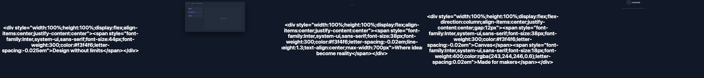

# Walkthrough — Canvas Brand Teaser

An 18-second cinematic-dark brand teaser that speaks through atmosphere, not feature lists. Ambient open → product glimpse → brand statement → tagline → logo. Confident and unhurried — the opposite register from the [product demo](product-demo.md).

**Project:** [`examples/brand-teaser/`](../../../examples/brand-teaser/)

## Contact Sheet



*Left to right: atmosphere open, product glimpse, brand statement, tagline close, logo.*

## 1. Brief

From [`brief.md`](../../../examples/brand-teaser/brief.md): Canvas, a design tool. Promise — "design freedom without compromise." Tone: cinematic-dark, prestige, confident. Proof: 50,000+ design teams.

## 2. Scenes → JSON

Scene 3 (brand statement) is a **kinetic-type-statement** beat — the line resolves with a soft delay while an accent line follows, under a near-still ambient drift:

```json
{
  "scene_id": "sc_03_brand_statement",
  "duration_s": 4,
  "motion": {
    "groups": [
      { "targets": ["statement"], "primitive": "as-fadeIn", "delay_ms": 300 },
      { "targets": ["accent_line"], "primitive": "as-fadeIn", "delay_ms": 800 }
    ],
    "camera": { "move": "drift", "intensity": 0.04 }
  }
}
```

Scene 1 (`sc_01_atmosphere_open`) sets the **ambient-brand-loop** mood before any message. See [`scenes/`](../../../examples/brand-teaser/scenes/).

## 3. Manifest → ordering

```json
{
  "sequence_id": "seq_brand_teaser_canvas",
  "resolution": { "w": 1920, "h": 1080 },
  "fps": 60,
  "style": "prestige",
  "scenes": [
    { "scene": "sc_01_atmosphere_open", "duration_s": 4 },
    { "scene": "sc_02_product_glimpse", "duration_s": 4, "transition_in": { "type": "crossfade", "duration_ms": 500 } },
    { "scene": "sc_03_brand_statement", "duration_s": 4, "transition_in": { "type": "crossfade", "duration_ms": 500 } },
    { "scene": "sc_05_logo", "duration_s": 2.5, "transition_in": { "type": "crossfade", "duration_ms": 500 } }
  ]
}
```

Abbreviated — full five-scene manifest at [`manifest.json`](../../../examples/brand-teaser/manifest.json). Total: 20s raw − 1.5s overlap = **18.5s**.

## 4. Render

No precompiled `render-props.json` — render through the sizzle pipeline:

```bash
node scripts/sizzle.mjs examples/brand-teaser/scenes \
  --style prestige --output renders/brand-teaser.mp4

node scripts/render-cookbook-contact-sheets.mjs brand-teaser
```

## Patterns demonstrated

| Scene | Cookbook pattern |
|-------|------------------|
| sc_01 atmosphere open | [ambient-brand-loop](../ambient-brand-loop.md) |
| sc_03 brand statement | [kinetic-type-statement](../kinetic-type-statement.md) |
| sc_05 logo | [logo-resolve-close](../logo-resolve-close.md) |
