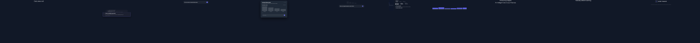

# Walkthrough — Fintech Insights Sizzle Reel

A 30-second product sizzle reel for an AI finance dashboard, recreating the [Mercury Insights breakdown](../../../.claude/skills/animate/reference/breakdowns/mercury-insights-sizzle.md). It chains five cookbook patterns into one cinematic-dark sequence: tagline → insight feed → AI prompt → chart drilldown → dashboard → logo close.

**Project:** [`examples/fintech-sizzle/`](../../../examples/fintech-sizzle/)

## Contact Sheet



*One still per scene, sampled at 60% through each. Left to right: opening tagline, insight cards, AI prompt input, chart drilldown, follow-up, dashboard reveal, "Introducing Insights", "Radically different banking", Mercury logo.*

## 1. Brief

The intent: show that an AI finance tool turns raw transactions into answered questions. Cinematic-dark, prestige pacing, 30s. See [`examples/fintech-sizzle/README.md`](../../../examples/fintech-sizzle/README.md) for the full scene-by-scene rationale and quality scores.

## 2. Scenes → JSON

Each scene is a v2 scene definition with a `motion` block referencing registry primitives. Scene 3 (AI prompt input) drives the panel with a single drilldown group:

```json
{
  "scene_id": "sc_03_prompt_input",
  "duration_s": 4,
  "brand": "fintech-demo",
  "camera": { "move": "static", "intensity": 0 },
  "motion": {
    "groups": [
      { "targets": ["prompt"], "primitive": "cd-panel-drilldown" }
    ]
  }
}
```

Scene 2 (insight cards) uses the **dashboard-data-build** grammar — a `card_conveyor` layer streaming insight cards with a gentle push-in. See [`scenes/sc_02_insight_cards.json`](../../../examples/fintech-sizzle/scenes/sc_02_insight_cards.json).

## 3. Manifest → ordering

The manifest orders the nine scenes with prestige-style transitions (crossfades between related beats, hard cuts between ideas):

```json
{
  "sequence_id": "seq_fintech_sizzle",
  "resolution": { "w": 1920, "h": 1080 },
  "fps": 60,
  "style": "prestige",
  "scenes": [
    { "scene": "sc_01_tagline_open", "duration_s": 3 },
    { "scene": "sc_02_insight_cards", "duration_s": 5, "transition_in": { "type": "crossfade", "duration_ms": 600 } },
    { "scene": "sc_03_prompt_input", "duration_s": 4, "transition_in": { "type": "hard_cut" } },
    { "scene": "sc_04_chart_drilldown", "duration_s": 5, "transition_in": { "type": "hard_cut" } },
    { "scene": "sc_09_logo", "duration_s": 2.5, "transition_in": { "type": "crossfade", "duration_ms": 500 } }
  ]
}
```

(Abbreviated — full nine-scene manifest at [`manifest.json`](../../../examples/fintech-sizzle/manifest.json).) Total: 33.5s raw − 2.8s transition overlap = **30.7s**.

## 4. Render

This project ships a precompiled `render-props.json` (manifest + scene defs + compiled timelines), so it renders directly:

```bash
# Full MP4
npx remotion render Sequence \
  --props=examples/fintech-sizzle/render-props.json \
  --output=renders/fintech-sizzle.mp4 --gl=angle

# Contact sheet (this doc's image)
node scripts/render-cookbook-contact-sheets.mjs fintech-sizzle
```

## Patterns demonstrated

| Scene | Cookbook pattern |
|-------|------------------|
| sc_02 insight cards | [card-conveyor-feed](../card-conveyor-feed.md) / [dashboard-data-build](../dashboard-data-build.md) |
| sc_03 prompt input | [chat-to-result-reveal](../chat-to-result-reveal.md) |
| sc_04 chart drilldown | [chart-drilldown-explain](../chart-drilldown-explain.md) |
| sc_06 dashboard reveal | [dashboard-data-build](../dashboard-data-build.md) |
| sc_09 logo | [logo-resolve-close](../logo-resolve-close.md) |
