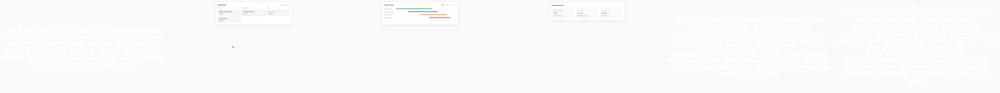

# Walkthrough — Taskflow Product Demo

A 24-second neutral-light product demo that lets the UI demonstrate value through real interactions rather than marketing motion. Context → feature demo → detail zoom → benefit proof → social proof → CTA. The restraint is deliberate: this is an instructional register, not a sizzle reel.

**Project:** [`examples/product-demo/`](../../../examples/product-demo/)

## Contact Sheet



*Left to right: context setup, feature demo (task board), detail zoom, benefit proof, social proof, CTA close.*

## 1. Brief

From [`brief.md`](../../../examples/product-demo/brief.md): Taskflow, a project-management tool. Promise — "clarity from chaos." Tone: neutral-light, minimal, functional. Proof: 10,000+ teams, 4.8-star average.

## 2. Scenes → JSON

Scene 2 (feature demo) uses **tutorial-spotlight** grammar — the task board fades in, then a cursor overlay enters to direct attention, under a slow neutral push-in:

```json
{
  "scene_id": "sc_02_feature_demo",
  "duration_s": 5,
  "motion": {
    "groups": [
      { "targets": ["task_board"], "primitive": "as-fadeIn", "delay_ms": 100 },
      { "targets": ["cursor_overlay"], "primitive": "as-fadeIn", "delay_ms": 800 }
    ],
    "camera": { "move": "push_in", "intensity": 0.08, "sync": { "peak_at": 0.6 } }
  }
}
```

See [`scenes/`](../../../examples/product-demo/scenes/) for all six. Scene 5 (social proof) follows the **testimonial-crossfade** pattern.

## 3. Manifest → ordering

```json
{
  "sequence_id": "seq_product_demo_taskflow",
  "resolution": { "w": 1920, "h": 1080 },
  "fps": 60,
  "style": "minimal",
  "scenes": [
    { "scene": "sc_01_context_setup", "duration_s": 3 },
    { "scene": "sc_02_feature_demo", "duration_s": 6, "transition_in": { "type": "hard_cut" } },
    { "scene": "sc_03_detail_zoom", "duration_s": 5, "transition_in": { "type": "crossfade", "duration_ms": 400 } },
    { "scene": "sc_06_cta_close", "duration_s": 3, "transition_in": { "type": "crossfade", "duration_ms": 400 } }
  ]
}
```

Abbreviated — full six-scene manifest at [`manifest.json`](../../../examples/product-demo/manifest.json). Total: 26s raw − 1.7s overlap = **24.3s**.

## 4. Render

This project has no precompiled `render-props.json`, so render through the sizzle pipeline (it compiles scenes → timelines → manifest → Remotion):

```bash
# Full MP4 — compiles the scenes folder, then renders
node scripts/sizzle.mjs examples/product-demo/scenes \
  --style minimal --output renders/product-demo.mp4

# Dry run (manifest only, no render) to inspect the plan first
node scripts/sizzle.mjs examples/product-demo/scenes --style minimal --dry-run

# Contact sheet (this doc's image)
node scripts/render-cookbook-contact-sheets.mjs product-demo
```

## Patterns demonstrated

| Scene | Cookbook pattern |
|-------|------------------|
| sc_02 feature demo | [tutorial-spotlight](../tutorial-spotlight.md) |
| sc_03 detail zoom | [tutorial-spotlight](../tutorial-spotlight.md) (zoom-assist variant) |
| sc_05 social proof | [testimonial-crossfade](../testimonial-crossfade.md) |
